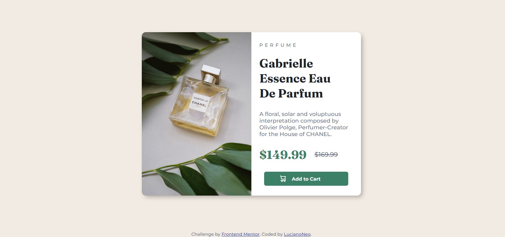

# Frontend Mentor - QR code component solution

This is a solution to the [QR code component challenge on Frontend Mentor](https://www.frontendmentor.io/challenges/qr-code-component-iux_sIO_H). Frontend Mentor challenges help you improve your coding skills by building realistic projects. 

## Table of contents

- [Overview](#overview)
  - [Screenshot](#screenshot)
  - [Links](#links)
- [My process](#my-process)
  - [Built with](#built-with)
  - [What I learned](#what-i-learned)
- [Author](#author)

## Overview

### Screenshot

### Links

- Solution URL: [Solution](https://github.com/LucianoNeo/FrontEnd-Mentor-Challenges/tree/master/product-preview-card)
- Live Site URL: [Live Site](https://lucianoneo.github.io/FrontEnd-Mentor-Challenges/product-preview-card/)

## My process

### Built with

- Semantic HTML5 markup
- CSS custom properties
- Flexgrid

### What I learned

In this project I have applied  the basics of css grid and media queries to get the site responsive.

## Author

- Website - [LucianoNeo](https://github.com/LucianoNeo)
- Frontend Mentor - [@LucianoNeo](https://www.frontendmentor.io/profile/LucianoNeo)
- Twitter - [@lucianoneo](https://www.twitter.com/lucianoneo)
